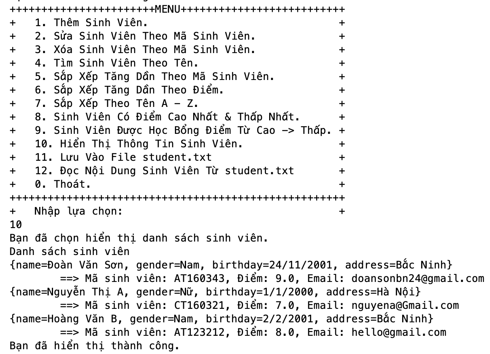

# QuanLySinhVien-OOP
Chương trình quản lý sinh viên bằng java. sử dụng file và ArrayList.

**Cách sử dụng:**
* Tải file và chạy studentManagementOOP/src/studentmanagement/Main.java

**Đây là code của mình.**

class Person:
<details><summary>Xem code</summary>
<p>

```java
/*
 * Click nbfs://nbhost/SystemFileSystem/Templates/Licenses/license-default.txt to change this license
 * Click nbfs://nbhost/SystemFileSystem/Templates/Classes/Class.java to edit this template
 */
package studentmanagement;

import java.util.Scanner;

/**
 *
 * @author doanvanson
 */
public class Person {
    String name, gender, birthday, address;

    // Constructor
    public Person() {
    }

    public Person(String name, String gender, String birthday, String address) {
        this.name = name;
        this.gender = gender;
        this.birthday = birthday;
        this.address = address;
    }

    // Getter / Setter
    public String getName() {
        return name;
    }

    public void setName(String name) {
        this.name = name;
    }

    public String getGender() {
        return gender;
    }

    public void setGender(String gender) {
        this.gender = gender;
    }

    public String getBirthday() {
        return birthday;
    }

    public void setBirthday(String birthday) {
        this.birthday = birthday;
    }

    public String getAddress() {
        return address;
    }

    public void setAddress(String address) {
        this.address = address;
    }

    @Override
    public String toString() {
        return "{" + "name=" + name + ", gender=" + gender + ", birthday=" + birthday + ", address=" + address + '}';
    }
    
    // Hiển thị thông tin
    public void showInfo() {
        System.out.println(this);
    }
    
    // Nhập thông tin
    public void inputInfo() {
        Scanner sc = new Scanner(System.in);
        System.out.println("Nhập Tên: ");
        name = sc.nextLine();
        
        System.out.println("Nhập Giới Tính: ");
        gender = sc.nextLine();
        
        System.out.println("Nhập Ngày Sinh: ");
        birthday = sc.nextLine();
        
        System.out.println("Nhập Địa Chỉ: ");
        address = sc.nextLine();
    }     
}

```

</p>
</details>


class Student:
<details><summary>Xem code</summary>
<p>

```java

/*
 * Click nbfs://nbhost/SystemFileSystem/Templates/Licenses/license-default.txt to change this license
 * Click nbfs://nbhost/SystemFileSystem/Templates/Classes/Class.java to edit this template
 */
package studentmanagement;

import java.util.Scanner;

/**
 *
 * @author doanvanson
 */
public class Student extends Person{
    String rollNo;
    float mark;
    String email;

    // Constructor
    public Student() {
    }
    
    // Getter / Setter
    public String getRollNo() {
        return rollNo;
    }

    public boolean setRollNo(String rollNo) {
        if(rollNo != null && rollNo.length() == 8) {
            this.rollNo = rollNo;
            return true;
        } else {
            System.out.printf("Nhập lại mã sinh viên (độ dài: 8 kí tự): ");
            return false;
        }
    }

    public float getMark() {
        return mark;
    }

    public boolean setMark(float mark) {
        if(mark >= 0 && mark <= 10) {
            this.mark = mark;
            return true;
        } else {
            System.out.printf("Nhập lại điểm (0 -> 10): ");
            return false;
        }
    }

    public String getEmail() {
        return email;
    }

    public boolean setEmail(String email) {
        if(email != null && !email.contains(" ") && email.contains("@")) {
            this.email = email;
            return true;
        } else {
            System.out.printf("Nhập lại email (Không có khoảng trắng, có kí tự @): ");
            return false;
        }
        
    }
    
    // override Nhập thông tin
    @Override
    public void inputInfo() {
        super.inputInfo();
        
        Scanner sc = new Scanner(System.in);
        System.out.println("Nhập mã sinh viên: ");
        while(true) {
            String rollNoInput = sc.nextLine();
            boolean check = setRollNo(rollNoInput);
            if(check) {
                break;
            }
        }
        
        System.out.println("Nhập điểm: ");
        while(true) {
            float markInput = Float.parseFloat(sc.nextLine());
            boolean check = setMark(markInput);
            if(check) {
                break;
            }
        }
        
        System.out.println("Nhập email: ");
        while(true) {
            String emailInput = sc.nextLine();
            boolean check = setEmail(emailInput);
            if(check) {
                break;
            }
        }
    }

    // override Hiển thị thông tin
    @Override
    public void showInfo() {
        super.showInfo();
        
        System.out.println("\t==> Mã sinh viên: " + rollNo + ", Điểm: " + mark + ", Email: " + email);
    }
    
    // Kiểm tra học bổng
    public boolean checkScholarship() {
        return (mark >= 8) ? true : false;
    }
    
    // format save file
    public String getFileLine() { 
        return rollNo + "," + name + "," + birthday + "," + gender + "," + mark +"," + email + "," + address + "\n"; 
    }
    
    // Parse file to Object
    public void parseFile(String line) {
        String[] params = line.split(",");
        
        try {
        rollNo = params[0];
        name = params[1];
        birthday = params[2];
        gender = params[3];
        mark = Float.parseFloat(params[4]);
        email = params[5];
        address = params[6];
        } catch(ArrayIndexOutOfBoundsException ex){
        } finally {   
        }
    }
}


```
</p>
</details>

class StudentManagement:
<details><summary>Xem code</summary>
<p>

```java

/*
 * Click nbfs://nbhost/SystemFileSystem/Templates/Licenses/license-default.txt to change this license
 * Click nbfs://nbhost/SystemFileSystem/Templates/Classes/Class.java to edit this template
 */
package studentmanagement;

import java.io.BufferedReader;
import java.io.FileInputStream;
import java.io.FileNotFoundException;
import java.io.FileOutputStream;
import java.io.IOException;
import java.io.InputStreamReader;
import java.io.UnsupportedEncodingException;
import java.nio.charset.StandardCharsets;
import java.util.ArrayList;
import java.util.Collections;
import java.util.Comparator;
import java.util.List;
import java.util.Scanner;
import java.util.logging.Level;
import java.util.logging.Logger;

/**
 *
 * @author doanvanson
 */
public class StudentManagement {
    Scanner sc = new Scanner(System.in);
    List<Student> studentList = new ArrayList<>();
    
    
    public void inputStudent() {
        System.out.println("Nhập số sinh viên cần thêm: ");
        int n = Integer.parseInt(sc.nextLine());
        
        for (int i = 0; i < n; i++) {
            Student std = new Student();
            std.inputInfo();
            
            studentList.add(std);
        }
        System.out.println("Bạn đã thêm thành công");
    }

    public void editStudentByRollNo() {
        Boolean flag = false;
        
        System.out.println("Nhập mã sinh viên cần sửa: ");
        String rollNo = sc.nextLine();
        
        for (Student student : studentList) {
            if(student.getRollNo().equalsIgnoreCase(rollNo)){
                student.inputInfo();
                flag = true;
                break;
            }
        }
        
        if(flag) {
            System.out.println("Sửa thành công.");
        } else {
            System.out.println("Không tìm thấy mã sinh viên: " + rollNo);
        }
    }

    public void deleteStudentByRollNo() {
        Boolean flag = false;
        
        System.out.println("Nhập mã sinh viên cần xóa: ");
         String rollNo = sc.nextLine();
        
        for (Student student : studentList) {
            if(student.getRollNo().equalsIgnoreCase(rollNo)){
                studentList.remove(student);
                flag = true;
                break;
            }
        }
        if(flag) {
            System.out.println("Bạn đã xóa thành công");
        } else {
            System.out.println("Không tìm thấy mã sinh viên: " + rollNo);
        }
    }
    
    public void findStudentByName() {
        Boolean flag = false;
        
        System.out.println("Nhập tên sinh viên cần tìm: ");
        String name = sc.nextLine();
        
        for (Student student : studentList) {
            if(student.getName().equalsIgnoreCase(name)){
                student.showInfo();
                flag = true;
                break;
            }
        }
        if(flag) {
            System.out.println("Bạn đã tìm thấy thành công");
        } else {
            System.out.println("Không tìm thấy sinh viên có tên: " + name);
        }
    }
    
    public void sortStudentByRollNo() {
      Collections.sort(studentList, new Comparator<Student>(){
            @Override
            public int compare(Student o1, Student o2) {
                return o1.getRollNo().compareTo(o2.getRollNo());
            }
        });
    }

    public void sortStudentByMark() {
        Collections.sort(studentList, new Comparator<Student>(){
            @Override
            public int compare(Student o1, Student o2) {
                return (o1.getMark() < o2.getMark()) ? -1 : 1;
            }
        });
    }

    public void sortStudentByName() {
        Collections.sort(studentList, new Comparator<Student>(){
            @Override
            public int compare(Student o1, Student o2) {
                return o1.getName().compareTo(o2.getName());
            }
            
        });
    }

    public void studentMinMaxByMark() {
        int minIndex = 0, maxIndex = 0;
        float minMark, maxMark;
        minMark = studentList.get(0).getMark();
        maxMark = studentList.get(0).getMark();
        
        for (int i = 1; i < studentList.size(); i++) {
            if(studentList.get(i).getMark() < minMark) {
                minIndex = i;
                minMark = studentList.get(i).getMark();
            }
            
            if(studentList.get(i).getMark() > maxMark) {
                maxIndex = i;
                maxMark = studentList.get(i).getMark();
            }
        }
        
        System.out.println("Sinh viên có điểm trung bình cao nhất: ");
        studentList.get(maxIndex).showInfo();
        
        System.out.println("Sinh viên có điểm trung bình thấp nhất: ");
        studentList.get(minIndex).showInfo();
    }
    
    public void scholarshipStudent() {
        Collections.sort(studentList, new Comparator<Student>(){
            @Override
            public int compare(Student o1, Student o2) {
                return (o1.getMark() < o2.getMark()) ? 1 : -1;
            }
        });
        
        for (Student student : studentList) {
            if(student.checkScholarship()) {
                student.showInfo();
            }
        }
    }
    
    public void displayStudent() {
        for (Student student : studentList) {
            student.showInfo();
        }
    }

    public void saveFile() {
        // Lưu file
        System.out.println("Bắt đầu lưu: ");
        FileOutputStream fos = null;
        
        try {
            fos = new FileOutputStream("student.txt");
            
            //Lưu dữ liệu
            for (Student student : studentList) {
                String line = student.getFileLine();
                // chuyển string to byte[]
                byte[] b = line.getBytes("utf8");
                //save
                fos.write(b);
            }
            
        } catch (FileNotFoundException ex) {
            Logger.getLogger(StudentManagement.class.getName()).log(Level.SEVERE, null, ex);
        } catch (UnsupportedEncodingException ex) {
            Logger.getLogger(StudentManagement.class.getName()).log(Level.SEVERE, null, ex);
        } catch (IOException ex) {
            Logger.getLogger(StudentManagement.class.getName()).log(Level.SEVERE, null, ex);
        } finally {
            if(fos != null) {
                try {
                    fos.close();
                } catch (IOException ex) {
                    Logger.getLogger(StudentManagement.class.getName()).log(Level.SEVERE, null, ex);
                }

            }
        }
    }

    public void readFile() {
        FileInputStream fis = null;
        InputStreamReader reader = null;
        BufferedReader bufferedReader = null;
        
        try {
            fis = new FileInputStream("student.txt");
            reader = new InputStreamReader(fis, StandardCharsets.UTF_8);
            bufferedReader = new BufferedReader(reader);
            
            String line = null;
            
            while((line = bufferedReader.readLine()) != null){
                if(line.isEmpty()){
                    continue;
                }
                Student std = new Student();
                std.parseFile(line);
                studentList.add(std);
            }
            
        } catch (FileNotFoundException ex) {
            Logger.getLogger(StudentManagement.class.getName()).log(Level.SEVERE, null, ex);
        } catch (IOException ex) {
            Logger.getLogger(StudentManagement.class.getName()).log(Level.SEVERE, null, ex);
        }  finally {
            if(fis != null) {            
                try {
                    fis.close();
                } catch (IOException ex) {
                    Logger.getLogger(StudentManagement.class.getName()).log(Level.SEVERE, null, ex);
                }               
            }
            
            if(reader != null) {
                try {
                    reader.close();
                } catch (IOException ex) {
                    Logger.getLogger(StudentManagement.class.getName()).log(Level.SEVERE, null, ex);
                } 
            }
            
            if(bufferedReader != null) {
                try {
                    bufferedReader.close();
                } catch (IOException ex) {
                    Logger.getLogger(StudentManagement.class.getName()).log(Level.SEVERE, null, ex);
                } 
            }
        }
    }
}


```
</p>
</details>

class Main:
<details><summary>Xem code</summary>
<p>

```java

/*
 * Click nbfs://nbhost/SystemFileSystem/Templates/Licenses/license-default.txt to change this license
 * Click nbfs://nbhost/SystemFileSystem/Templates/Classes/Class.java to edit this template
 */
package studentmanagement;

import java.util.Scanner;

/**
 *
 * @author doanvanson
 */
public class Main {
    public static void main(String[] args) {
        Scanner sc = new Scanner(System.in);
        StudentManagement stdManage = new StudentManagement();
        int choose;
        
        do {            
            showMenu();
            choose = Integer.parseInt(sc.nextLine());
            
            switch(choose){
                case 1: 
                    System.out.println("Bạn đã chọn thêm sinh viên.");
                    stdManage.inputStudent();
                    break;
                case 2: 
                    System.out.println("Bạn đã chọn sửa thông tin sinh viên.");
                    stdManage.editStudentByRollNo();
                    break;
                case 3: 
                    System.out.println("Bạn đã chọn xóa sinh viên.");
                    stdManage.deleteStudentByRollNo();
                    break;
                case 4:
                    System.out.println("Bạn đã chọn tìm sinh viên.");
                    stdManage.findStudentByName();
                    break;
                case 5:  
                    System.out.println("Bạn đã chọn sắp xếp tăng dần theo mã sinh viên.");
                    stdManage.sortStudentByRollNo();
                    System.out.println("Sắp xếp thành công.");
                    break;
                case 6: 
                    System.out.println("Bạn đã chọn sắp xếp tăng dần theo điểm.");
                    stdManage.sortStudentByMark();
                    System.out.println("Sắp xếp thành công.");
                    break;
                case 7: 
                    System.out.println("Bạn đã chọn sắp xếp A- Z theo tên.");
                    stdManage.sortStudentByName();
                    System.out.println("Sắp xếp thành công.");
                    break;
                case 8: 
                    System.out.println("Bạn đã chọn sinh viên có điểm cao nhất & thấp nhất.");
                    stdManage.studentMinMaxByMark();
                    System.out.println("Bạn đã hiển thị thành công.");
                    break;
                case 9: 
                    System.out.println("Bạn đã chọn sinh viên được học bổng từ cao -> thấp.");
                    stdManage.scholarshipStudent();
                    System.out.println("Bạn đã hiển thị thành công.");
                    break;
                case 10: 
                    System.out.println("Bạn đã chọn hiển thị danh sách sinh viên.");
                    System.out.println("Danh sách sinh viên");
                    stdManage.displayStudent();
                    System.out.println("Bạn đã hiển thị thành công.");
                    break;
                case 11: 
                    System.out.println("Bạn đã chọn lưu vào file.");
                    stdManage.saveFile();
                    System.out.println("Bạn đã lưu thành công.");
                    break;
                case 12: 
                    System.out.println("Bạn đã chọn đọc nội dung từ file.");
                    stdManage.readFile();
                    System.out.println("Nội dung đã được đọc.");
                    break;
                case 0:
                    System.out.println("Bạn đã dừng chương trình.");
                    break;
                default:
                    System.out.println("Vui lòng nhập từ 0 -> 10 !!!");
            }
            
        } while (choose != 0);
    }
    
    static void showMenu(){
        System.out.println("+++++++++++++++++++++++MENU++++++++++++++++++++++++++");
        System.out.println("+   1. Thêm Sinh Viên.                              +");
        System.out.println("+   2. Sửa Sinh Viên Theo Mã Sinh Viên.             +");
        System.out.println("+   3. Xóa Sinh Viên Theo Mã Sinh Viên.             +");
        System.out.println("+   4. Tìm Sinh Viên Theo Tên.                      +");
        System.out.println("+   5. Sắp Xếp Tăng Dần Theo Mã Sinh Viên.          +");
        System.out.println("+   6. Sắp Xếp Tăng Dần Theo Điểm.                  +");
        System.out.println("+   7. Sắp Xếp Theo Tên A - Z.                      +");
        System.out.println("+   8. Sinh Viên Có Điểm Cao Nhất & Thấp Nhất.      +");
        System.out.println("+   9. Sinh Viên Được Học Bổng Điểm Từ Cao -> Thấp. +");   
        System.out.println("+   10. Hiển Thị Thông Tin Sinh Viên.               +");
        System.out.println("+   11. Lưu Vào File student.txt                    +");
        System.out.println("+   12. Đọc Nội Dung Sinh Viên Từ student.txt       +");
        System.out.println("+   0. Thoát.                                       +");
        System.out.println("+++++++++++++++++++++++++++++++++++++++++++++++++++++");
        System.out.println("+   Nhập lựa chọn:                                  +");
        
    }
}


```
</p>
</details>


**code gồm các chức năng như sau:**


khi chọn chức năng thứ 1:


khi chọn chức năng thứ 2:


khi chọn chức năng thứ 3:


khi chọn chức năng thứ 4:


khi chọn chức năng thứ 5:


khi chọn chức năng thứ 6:


khi chọn chức năng thứ 7:


khi chọn chức năng thứ 8:


khi chọn chức năng thứ 9:


khi chọn chức năng thứ 10:


khi chọn chức năng thứ 11:


khi chọn chức năng thứ 12:

